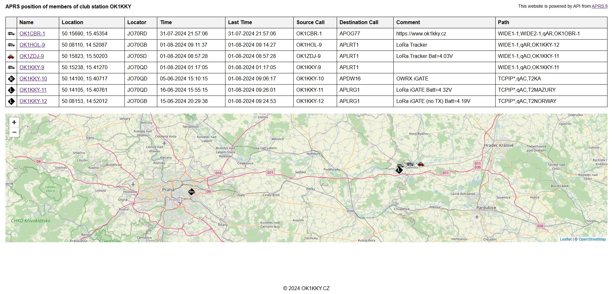

# APRS.fi API web
A simple website that uses the API from the aprs.fi server  information

## Features

The website can display the following information Name (Callsign), Location, Locator, Time, Last Time, Source Call, Destination Call, Comment, Path and also a map with the location of the displayed stations.




## Do not forget!
In the script.js file:

Change MYCALL-1 to your call sign.
```javascript
const url = 'api-proxy.php?name=MYCALL-1&what=loc'
```

In the api-proxy.php file:

Change YOUR_API_KEY to your api key obtained from [APRS.fi](https://aprs.fi/)
```php
$api_key = 'YOUR_API_KEY';
```

## Demo

Try the demo here: [aprs.ok1kky.cz](https://aprs.ok1kky.cz/)


#### Support & Feedback

